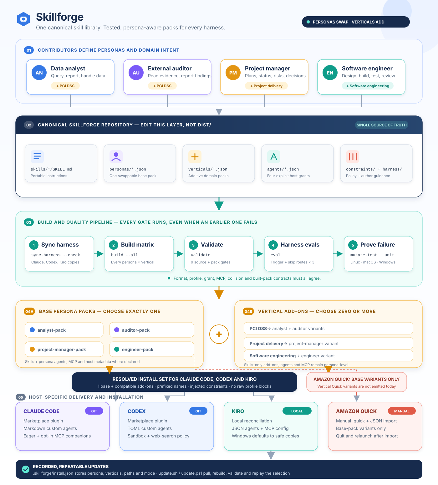

# Skillforge

Skillforge is a build and distribution system for portable agent skills. Teams keep skills,
personas, policy constraints, vertical add-ons, and agent permissions in one repository; Skillforge
resolves that source into tested packages for **Claude Code, Codex, Kiro, and Amazon Quick**.

> **Personas swap. Verticals add.**
>
> A user selects exactly one persona pack and may add any number of compatible vertical packs.



Editable diagram sources:
[Mermaid](docs/diagrams/skillforge-lifecycle.mmd) ·
[PlantUML](docs/diagrams/skillforge-lifecycle.puml) ·
[D2](docs/diagrams/skillforge-lifecycle.d2) ·
[draw.io](docs/diagrams/skillforge-lifecycle.drawio) ·
[ASCII](docs/diagrams/skillforge-lifecycle.txt) ·
[PNG](docs/diagrams/skillforge-lifecycle.png) ·
[PDF](docs/diagrams/skillforge-lifecycle.pdf)

Repository social preview:
[PNG](docs/social-preview/skillforge-social-preview.png) ·
[editable SVG](docs/social-preview/skillforge-social-preview.svg)

## What Skillforge does

Skillforge turns a canonical repository into a distribution matrix:

1. Contributors define reusable skills, personas, verticals, constraints, and agents.
2. The build resolves persona-specific branches, injects applicable constraints, prefixes names,
   and generates one base pack per persona plus one pack per compatible persona/vertical pair.
3. Validation checks both the source and the files that will actually be installed.
4. Harness evaluations verify that Claude Code, Codex, and Kiro discover the repository authoring
   skill for the right prompts.
5. Mutation tests deliberately break each validation contract and prove that every gate rejects
   the defect.
6. Host-specific installers and marketplaces deliver the selected packs without overwriting
   user-owned configuration.

This is useful when the same capability must behave differently for different audiences or
domains, while still being maintained and reviewed as one body of source.

## Quick start

The core CLI uses the Python standard library. Run it from the repository root with Python 3.11 or
newer.

```bash
git clone https://github.com/aws-samples/sample-skillforge.git
cd sample-skillforge

python3 -m skillforge sync-harness --check
python3 -m skillforge build --all --vertical all
python3 -m skillforge validate
python3 -m skillforge eval
python3 -m skillforge mutate-test
python3 -m unittest discover -s tests -v
```

On Windows PowerShell, use `py -3` in place of `python3`:

```powershell
py -3 -m skillforge build --all --vertical all
py -3 -m skillforge validate
py -3 -m skillforge eval
py -3 -m skillforge mutate-test
py -3 -m unittest discover -s tests -v
```

The generated distribution is written to `dist/`. It is intentionally checked into Git because
Claude Code and Codex install directly from the repository; no build runs while their marketplaces
resolve a package.

## The five source concepts

| Concept | Canonical location | Purpose |
|---|---|---|
| Skill | `skills/<name>/SKILL.md` | Portable instructions following the Agent Skills format |
| Persona | `policies/personas/<id>.json` | A swappable audience pack, its prefix, base skills, router, and agents |
| Vertical | `policies/verticals/<id>.json` plus tagged skills | Additive domain, industry, product, or compliance content |
| Constraint | `policies/constraints/<id>/<persona>.md` | Persona-specific boundaries injected into every skill that binds the constraint |
| Agent | `agents/<id>.json` | Persona-level instructions and explicit native grants for all four hosts |

### Personas swap

A persona defines the user's working role and base catalogue. Installing `engineer-pack` after
`project-manager-pack` removes the managed project-manager selection rather than leaving
contradictory copies installed together.

### Verticals add

A vertical contributes optional skills beside the selected persona. For example,
`software-engineering` adds design and review workflows to the engineer without duplicating the
engineer's base skills, agents, or MCP configuration.

A vertical-tagged skill must never also appear in a persona's `include_skills`. Every host flattens
installed skills into one namespace, so that duplication would cause one copy to hide the other.
The validator rejects it.

### Constraints centralize policy

Use a constraint when the work is the same but its boundaries differ by persona. One policy change
then updates every bound skill at build time.

### Conditional blocks change the work

Use profile blocks only when the actual procedure differs:

```markdown
<!-- profile:analyst -->
Pull the figures with `query-warehouse`.
<!-- /profile -->
<!-- profile:auditor -->
Request an approved extract and record its provenance.
<!-- /profile -->
```

Every conditional group must name every persona, including explicit empty branches. A missing
branch is treated as an authoring error. Profile markers are resolved during the build and are
forbidden in generated packs.

### Agents make host permissions explicit

One canonical agent generates four native shapes:

- Claude Code Markdown with an exact tool allowlist;
- Codex TOML with sandbox and web-search policy;
- Kiro JSON with `tools` and `allowedTools`;
- Amazon Quick JSON with its supported tools.

There are no broad default grants. If a canonical agent omits a host, validation fails.

## Included example matrix

The repository includes four example personas and three verticals:

| Persona | Base pack | Canonical agent | Compatible vertical | Generated vertical pack |
|---|---|---|---|---|
| Data analyst | `analyst-pack` | — | PCI DSS | `vertical-pci-dss-analyst` |
| External auditor | `auditor-pack` | — | PCI DSS | `vertical-pci-dss-auditor` |
| Project manager | `project-manager-pack` | `project-manager` | Project delivery | `vertical-project-delivery-project-manager` |
| Software engineer | `engineer-pack` | `software-engineer` | Software engineering | `vertical-software-engineering-engineer` |

These are working examples to adapt or replace with your own content.

## What the build generates

For a base persona pack:

```text
dist/engineer-pack/
├── skills/                         portable, resolved skills
├── agents/
│   ├── eng-software-engineer.md    Claude Code
│   ├── codex/*.toml                Codex
│   ├── kiro/*.json                 Kiro
│   ├── quick/*.json                Amazon Quick
│   └── manifest.json               cross-host names and grants
├── .claude-plugin/plugin.json      Claude Code plugin manifest
├── .mcp.json                       eager Claude Code MCP servers
├── mcp-plugins/                    opt-in Claude Code MCP companions
├── mcp/kiro-mcp.json               Kiro MCP configuration
└── quick/*.quick                   Amazon Quick skill variants
```

For a vertical pack:

```text
dist/vertical-software-engineering-engineer/
├── skills/                         resolved vertical skills
└── .claude-plugin/plugin.json      marketplace/package metadata
```

Vertical packs intentionally contain no agents or MCP configuration. Those are persona-level
concerns and remain in the base pack. Amazon Quick vertical variants are not emitted today; Quick
receives eligible base-pack `.quick` skills and base-pack agent JSON through manual import.

The build also regenerates both repository marketplaces:

```text
.claude-plugin/marketplace.json     Claude Code
.agents/plugins/marketplace.json    Codex
```

## Quality gates

Run the complete release check with:

```bash
python3 -m skillforge build --all --vertical all
python3 -m skillforge validate
python3 -m skillforge eval
python3 -m skillforge mutate-test
python3 -m unittest discover -s tests -v
```

`validate` runs all gates and reports all discovered problems in one pass:

| Gate | What it protects |
|---|---|
| `harness-instructions` | Shared repository instructions and synchronized host adapters |
| `skills` | Skill names, frontmatter, activation descriptions, and format limits |
| `conditional-blocks` | Complete, well-formed persona branches in every shipped text file |
| `personas` | Unique packs and prefixes, valid routers, skill inventories, and vertical separation |
| `agents` | Canonical agents, inclusion, unique generated names, and four explicit grant shapes |
| `mcp` | Derived entitlement, safe loading mode, usable server definitions, and vertical boundaries |
| `eval-cases` | Complete trigger and non-trigger cases for Claude Code, Codex, and Kiro |
| `cross-host-collisions` | Names that would flatten onto the same installed skill or agent |
| `built-packs` | The generated files, manifests, references, grants, marketplaces, and install sets |

`eval` executes the checked-in deterministic routing matrix in
`evals/skillforge-authoring.json`.

`mutate-test` creates an isolated project for every validator, injects a representative defect,
and fails if the corresponding gate does not catch it.

The unit suite covers authoring workflows, exact pack inventories, host-native agent formats,
marketplace agreement, Kiro and Codex reconciliation, MCP adoption and restoration, recorded
updates, Windows copy mode, and reproducible builds. GitHub Actions runs the suite on Linux,
macOS, and Windows.

Optional live host validators can be enabled when the native CLIs are installed:

```bash
SKILLFORGE_RUN_EXTERNAL_HARNESSES=1 \
  python3 -m unittest discover -s tests -p 'test_external_validators.py' -v
```

## Install a persona and vertical

Build and validate before installation:

```bash
python3 -m skillforge build --all --vertical all
python3 -m skillforge validate
```

The examples below select the software-engineer persona and its software-engineering vertical.

### Claude Code

```bash
claude plugin marketplace add aws-samples/sample-skillforge
claude plugin install engineer-pack@skillforge
claude plugin install vertical-software-engineering-engineer@skillforge
```

### Codex

```bash
codex plugin marketplace add aws-samples/sample-skillforge
codex plugin add engineer-pack@skillforge
codex plugin add vertical-software-engineering-engineer@skillforge
```

### Kiro

```bash
python3 -m skillforge install \
  --persona engineer \
  --vertical software-engineering
```

Kiro has no repository marketplace, so Skillforge reconciles its skills, agents, and MCP settings
locally. On macOS and Linux, managed skills are symlinked by default. On Windows, they are copied by
default so Developer Mode or administrator symlink privileges are not required. Use `--copy` or
`--symlink` to override the default.

To also reconcile Codex custom-agent files and record native Claude Code/Codex updates, use:

```bash
python3 -m skillforge install \
  --host all \
  --persona engineer \
  --vertical software-engineering
```

The installer never deletes an MCP server that the user created. Existing entries are adopted,
marked separately, and restored to their original enabled state when they leave the selection or
when Skillforge is uninstalled.

### Amazon Quick

Import eligible `.quick` files and agent JSON manually from the selected base pack:

```text
dist/engineer-pack/quick/
dist/engineer-pack/agents/quick/
```

Quit and relaunch Amazon Quick after importing. Quick reads these skills only at launch.

## Recorded, cross-platform updates

Every successful local install writes a non-secret receipt to:

```text
.skillforge/install.json
```

The receipt records the persona, selected verticals, host mode, copy/symlink mode, version,
marketplace name, and resolved Kiro and Codex paths. The directory is gitignored, so the user's
selection survives a pull without being committed.

Inspect the recorded selection:

```bash
python3 -m skillforge update --check
```

Pull with fast-forward-only safety, rebuild every pack, run validation, and replay the selection:

```bash
# macOS / Linux
./scripts/update.sh
```

```powershell
# Windows PowerShell
.\scripts\update.ps1
```

Or run the Python command after pulling manually:

```bash
python3 -m skillforge update
```

If the receipt was created with `--host all`, the update also refreshes native Claude Code and
Codex plugins when those CLIs are available. Use `--no-native` to print the commands without
executing them.

## Author with Claude Code, Codex, or Kiro

The repository gives all three coding harnesses the same authoring procedure:

- `AGENTS.md` is the canonical repository instruction file for Codex and Kiro.
- `CLAUDE.md` imports `AGENTS.md` for Claude Code.
- `harness/skills/skillforge-authoring/` is the canonical authoring skill.
- `.agents/skills/`, `.claude/skills/`, and `.kiro/skills/` contain generated host copies.

The authoring skill routes persona, vertical, agent, constraint, canonical-skill, and host-contract
changes to focused references. Edit the canonical copy only, then synchronize it:

```bash
python3 -m skillforge sync-harness
python3 -m skillforge sync-harness --check
```

Useful authoring references:

- [Add a persona](harness/skills/skillforge-authoring/references/add-persona.md)
- [Add a vertical](harness/skills/skillforge-authoring/references/add-vertical.md)
- [Add an agent and host grants](harness/skills/skillforge-authoring/references/add-agent.md)
- [Create or review a skill](harness/skills/skillforge-authoring/references/skill-quality.md)
- [Change host packaging or installation](harness/skills/skillforge-authoring/references/harness-contracts.md)

Kiro's default agent discovers the workspace skill automatically. A custom Kiro agent should add
`skill://.kiro/skills/skillforge-authoring/SKILL.md` to its `resources`.

## Project layout

```text
.
├── skills/                 canonical portable skills
├── agents/                 canonical agents and per-host grants
├── policies/
│   ├── personas/           swappable audience packs
│   ├── verticals/          additive domain packs
│   └── constraints/        reusable persona-specific boundaries
├── mcp/                    server groups and loading/access policy
├── harness/                canonical repository authoring skill
├── evals/                  deterministic harness-routing cases
├── skillforge/             build, validate, install, update, eval, mutation CLI
├── tests/                  contracts and integration tests
├── scripts/                POSIX and PowerShell update entry points
├── docs/diagrams/          lifecycle diagram and editable sources
└── dist/                   generated, checked-in installable packs
```

## Security

See [CONTRIBUTING](CONTRIBUTING.md#security-issue-notifications) for security reporting
instructions.

## License

This project is licensed under the Apache-2.0 License.

## Status

Skillforge is currently version **0.2.0**. Its source model, four host output shapes, generated
marketplaces, persona agents, Kiro/Codex reconciliation, safe MCP handling, cross-platform update
receipts, deterministic harness evaluations, collision detection, mutation harness, and CI
contracts are implemented. The repository remains an early sample intended to be adapted and
extended.
